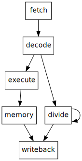

# A Domain Specific Language for Complex Processor Pipelines

**Note:** This project is still in an early stage of development. I am not sure yet whether I will continue working on it.

An embedded domain specific language for designing processor cores.
It allows you to describe the pipeline structure of a processor and automatically genereates the required stall and forwarding logic.
For example, a three stage pipelined processor with forwarding could be described as follows:

```python
pc = builder.resource(RegisterResource("pc", 32))
reg_file = builder.resource(MemoryResource("reg_file", 32, size = 32, read_delay = 0))
inst_mem = builder.resource(MemoryResource("inst_mem", 32, size = 1 << 24, read_delay = 0))

fetch_group = builder.group("fetch")
execute_group = builder.group("execute")
writeback_group = builder.group("writeback")

with fetch_group:
    pc_value = pc.read()
    instruction = inst_mem.read(pc_value)

    ...

    builder.then(execute_group())

with execute_group:
    ...

    pc.write(pc_value + 1)

    ...

    # We can already forward the result here if it is an ALU operation
    reg_file.forward(alu_res, index = rd, enable = alu_valid)

    builder.then(writeback_group())

with writeback_group:
    result = builder.cond(
        (alu_valid, alu_res),
        (mem_read, mem_data),
        (0, )
    )

    # Write back to the register file
    reg_file.write(result, index=rd, enable = alu_valid | mem_read)

    builder.then(builder.commit())
```

Each pipeline stage is represented by a group.
Control flow between stages is expressed using `builder.then()`.
Dependencies between stages are automatically detected and the pipeline is stalled when necessary.

## An Example Processor

Currently the main focus is on developing a RV32IM processor core with a 5-stage pipeline using this DSL.
It branches after the decode stage and handles division instructions using a separate execution unit.
Here is a diagram generated from the current implementation:



## Related Work

Most closely related is PDL [1], which also automatically handles pipeline conflicts.
This project aims to expand upon their work by supporting pipelines with branching and out-of-order execution.
Right now, this is still in progress. (TODO: There are more differences, I think, elaborate here.)
Spade [3] is another HDL with support for pipeline abstractions, however, it does not solve conflicts automatically.
Instead pipeline stalls and forwarding must be specified manually.
PipelineC [2] generates pipelines automatically based on timing information, ensuring that a given FMAX is met.
It does however also not handle pipeline conflicts.

## References

1. Drew Zagieboylo, Charles Sherk, Gookwon Edward Suh, and Andrew C. Myers. PDL: a high-level hardware design language for pipelined processors. PLDI 2022. https://doi.org/10.1145/3519939.3523455
2. Julian Kemmerer. PipelineC: Easier Hardware Description Between RTL and HLS. LATTE 2023.
3. Frans Skarman, Oscar Gustafsson. Spade: An HDL Inspired by Modern Software Languages. FPL 2022. https://doi.org/10.1109/FPL57034.2022.00075

## License

   Copyright 2025 Can Joshua Lehmann

   Licensed under the Apache License, Version 2.0 (the "License");
   you may not use this file except in compliance with the License.
   You may obtain a copy of the License at

       http://www.apache.org/licenses/LICENSE-2.0

   Unless required by applicable law or agreed to in writing, software
   distributed under the License is distributed on an "AS IS" BASIS,
   WITHOUT WARRANTIES OR CONDITIONS OF ANY KIND, either express or implied.
   See the License for the specific language governing permissions and
   limitations under the License.
